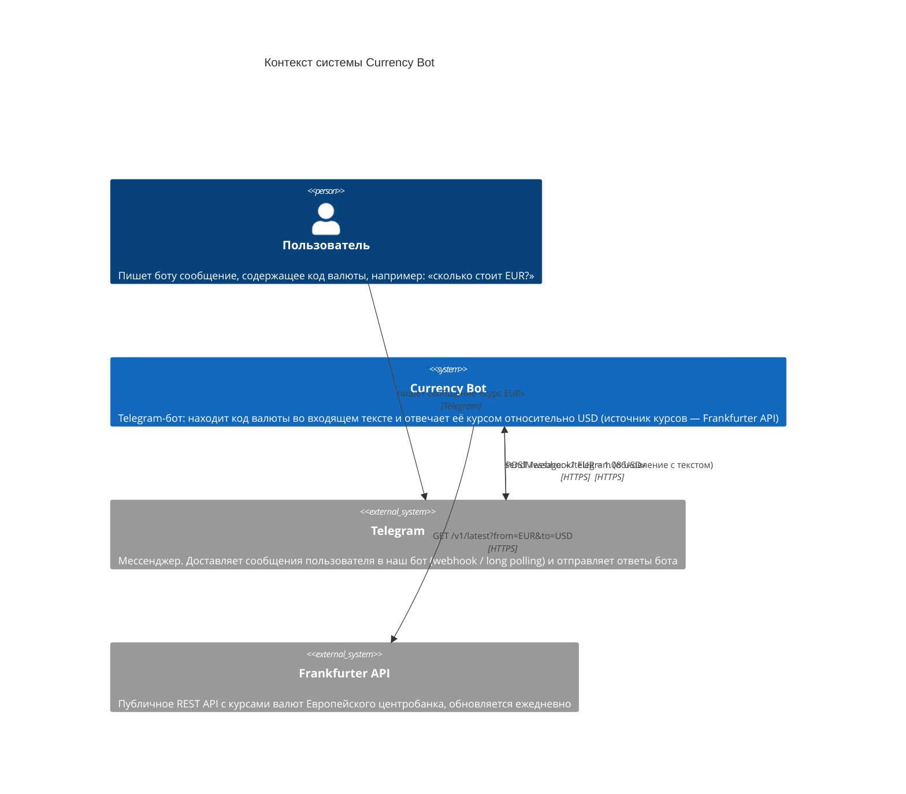

# C4 — уровень 1: Context

> Диаграмму можно открыть в https://mermaid.live (вставить код ниже) или в редакторе с поддержкой Mermaid и экспортировать в PNG/SVG для сдачи.

## Словами

- **Пользователь** — внешний человек, единственный источник запросов.
- **Currency Bot** — система, которую мы пишем. Она ничего не хранит, не имеет БД: получила сообщение → сходила за курсом → ответила.
- **Telegram** — внешняя платформа: и вход (сообщения пользователя), и выход (наши ответы).
- **Frankfurter API** — внешний источник данных о курсах (все валюты заданы относительно USD через параметры `from`/`to`).
