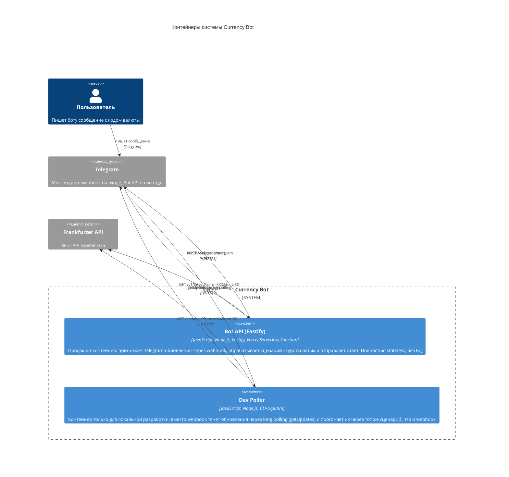

# C4 — уровень 2: Container

## Словами

- **Bot API (Fastify)** — единственный продакшн-контейнер. Живёт как serverless-функция на Vercel: Vercel принимает HTTPS-запрос от Telegram и отдаёт его Fastify-приложению.
- **Dev Poller** — не попадает в продакшн. Нужен, чтобы разрабатывать локально без публичного URL и webhook. Важно: это не второй бот, а второй «вход» в одну и ту же логику (см. компоненты).
- Почему webhook, а не polling в проде: serverless-функция живёт не дольше одного запроса — держать бесконечный цикл `getUpdates` там нельзя. Webhook — единственный нормальный режим для Vercel.
