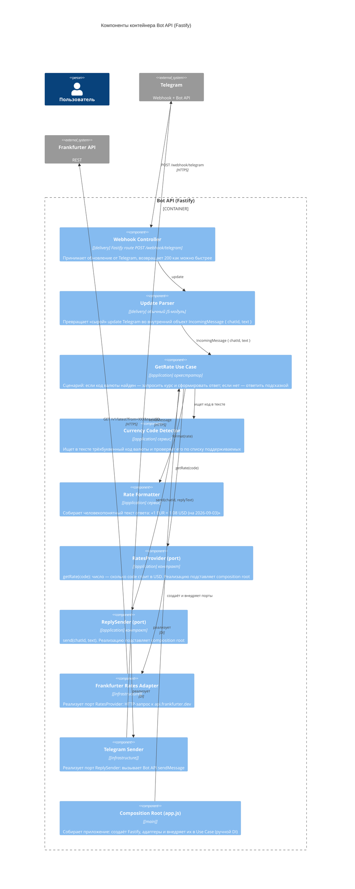

# C4 — уровень 3: Component (внутри контейнера Bot API)

Слои чистой архитектуры помечены в квадратных скобках у компонентов. Зависимости направлены **внутрь**: delivery → application → domain; инфраструктура реализует порты, а не наоборот.

## Как читать (слои)

| Слой | Что лежит | Кто на кого смотрит |
|---|---|---|
| `domain` | правила: код валюты = 3 буквы, список поддерживаемых | ни на кого |
| `application` | Use Case, детектор, форматтер, **порты** (контракты) | только на domain |
| `infrastructure` | Frankfurter-адаптер, Telegram Sender | реализуют порты application |
| `delivery` | webhook-контроллер, poller | вызывают Use Case |
| `main` (composition root) | сборка, DI | знает про все слои — единственное место, где они встречаются |

Стрелки на диаграмме рисуют зависимости *использования*. Порт и адаптер показаны парой, чтобы было видно инверсию: application определяет интерфейс, infrastructure его реализует.

## Один Use Case — два входа

Webhook Controller и Dev Poller — оба «driving adapter». Поэтому на уровне компонентов poller показывает те же стрелки в Use Case; логика бота написана один раз и не знает, откуда пришло сообщение.
